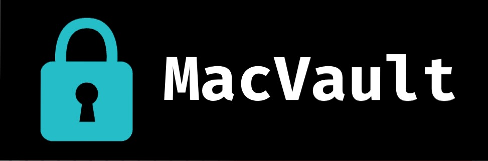

# MacVault
# Bug Patch 1.0.13
A portable encrypted file store for macOS. AES-256 at every layer. Zero trace when locked. Installs as an innocuous system utility — nothing about it suggests encryption at a glance.

## Install

~~~bash
# One-liner (clones repo, installs `mvs` to ~/.local/bin)
curl -sL https://raw.githubusercontent.com/paragon-William/MacVault/main/install.sh | bash

# Custom name and path
curl -sL https://raw.githubusercontent.com/paragon-William/MacVault/main/install.sh | bash -s /usr/local/bin mytool

# Or clone manually
git clone https://github.com/paragon-William/MacVault.git
cd MacVault && bash build/install
~~~

Requires only `python3`, `openssl`, and `git` — all included with macOS.

## Quick start

~~~bash
mvs init                        # creates ~/.local/share/mvs/<random>.sparsebundle
mvs open                        # prompts for passphrase, mounts
mvs add ~/Documents/tax.pdf     # move a file into the store
mvs add ~/Desktop/project/      # move a folder (drag & drop works)
mvs list                        # show what's tracked
mvs show                        # restore all files to origin (keeps tracking)
# ... work on files ...
mvs hide                        # instant re-hide (under 2 sec, any size)
mvs remove ~/Documents/tax.pdf  # restore a file by path
mvs remove                      # interactive: pick by number
mvs restore                     # restore ALL files (clears tracking)
mvs close                       # lock & unmount
mvs status                      # check what's where
~~~

## Commands

| Command | Description |
|---|---|
| `mvs init [path]` | Create store (random name at default location if no path) |
| `mvs open [path]` | Unlock and mount (default store if no path) |
| `mvs close` | Lock and unmount |
| `mvs add [path]` | Move file in (interactive prompt if no path) |
| `mvs remove [path]` | Restore file (numbered list if no path) |
| `mvs list` | Show all tracked files |
| `mvs show` | Restore all to origin (keeps tracking — reversible with hide) |
| `mvs hide` | Hide all tracked back into store (instant mv, any size) |
| `mvs restore` | Restore ALL files and clear tracking |
| `mvs status` | Show location and lock state |
| `mvs uninstall` | Restore all, delete store, remove self |

## Project structure

~~~
install.sh                 # Bootstrap: clones repo, runs build/install
build/
  install                  # Actual installer script
  mvs                      # The Python CLI tool
  version.json             # Remote version info for auto-update
README.md
.gitignore
~~~

## How it works

~~~
mvs init
  → creates AES-256 encrypted APFS sparsebundle at ~/.local/share/mvs/<random>.sparsebundle
  → creates empty AES-256-CBC encrypted manifest inside

mvs open → mvs show
  → prompts for passphrase
  → hdiutil attach (APFS AES-256) at /tmp/.mvs_XXXXX
  → openssl decrypts .manifest.enc → all files restored to origin
  → manifest preserved for re-hide

mvs hide
  → shutil.move all tracked files back into mount (instant — same APFS volume)
  → re-encrypts manifest

mvs close
  → re-encrypts manifest → hdiutil detach → removes temp mount
  → vault file is opaque random data
~~~

## Security

- **Dual-layer AES-256**: APFS image encryption + `openssl enc -aes-256-gcm` manifest encryption with authentication. Even when mounted, file paths are ciphertext.
- **Argon2id key derivation**: Memory-hard key derivation prevents GPU-accelerated brute-force attacks (falls back to PBKDF2 on older OpenSSL).
- **Atomic manifest writes**: Manifest is never overwritten in place — writes go to a temp file first, then atomically swapped to prevent corruption.
- **Passphrase never stored**: Provided at runtime. No recovery — lose it, lose the data.
- **No daemon, no root**: Runs only when invoked. No background processes.
- **No hardcoded secrets**: Zero keys or passphrases in the script.
- **Zero trace when locked**: The sparsebundle is indistinguishable from random bytes.